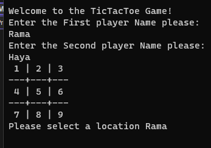

# Lab04_TicTacToe

#
## Tic Tac Game:
+ It's a board consist of 9 cells each player takes a turn either **X** or **Y** and place a mark in specific cell in the board The goal of the game is for players to position their marks so that they make a continuous line of three cells vertically, horizontally, or diagonally.

#
## What it's look like:

#
## How they use it ?
+ First select players and specify which one want to take the X and the other Y
+ Satrt with the X choose one of the numbers and make sure to think quickly about your goal which is to make a line of X to win 
+ Put the X and the best place to start with is the number 5 at the middle it gives 
+ Ask the other player to choose a number and pay attension to other player moves don't let him win!.
+ Try to choose 1 after 5 and for the next number choose 3 if available that will make your chance bigger to win.

